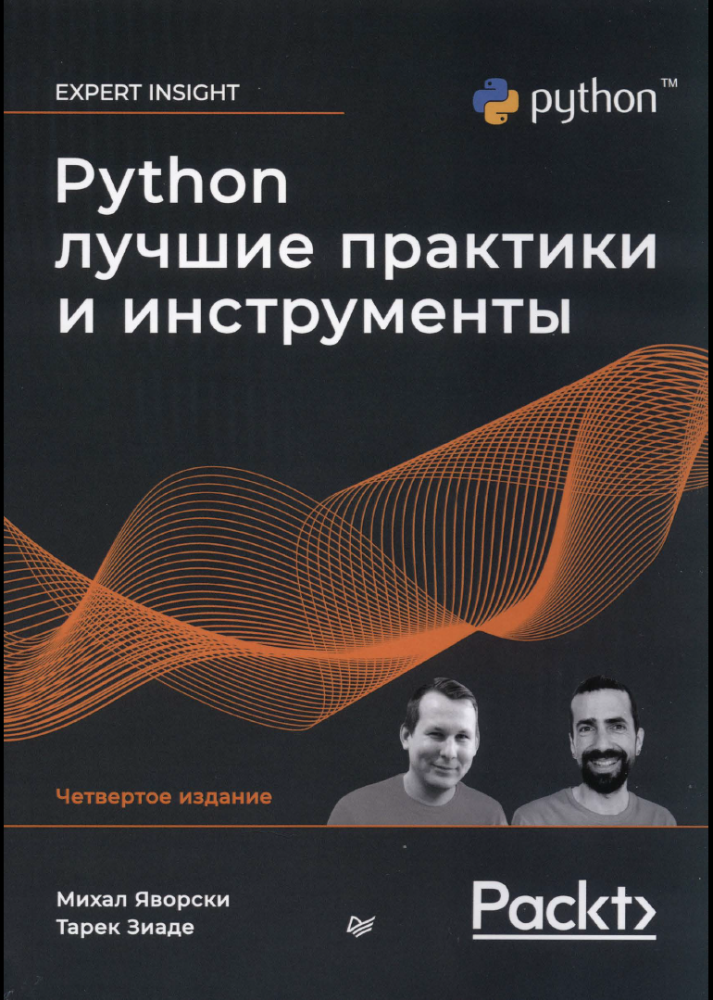

# Python best practices and instruments
Изучаем книгу Python.
<div style="text-align: left;">

</div>

# Содержание
```txt
Об авторах •••••••••••••••••••••••••••••••••••••••••••••••••••••••• 14
О научном редакторе ••••••••••••••••••••••••••••••••••••••••••••••• 15
Предисловие ••••••••••••••••••••••••••••••••••••••••••••••••••••••• 16
От издате1118ства ••••••••••••••••••••••••••••••••••••••••••••••••• 21
Глава 1. Pythoп сегодняшнего дня •••••••••••••••••••••••••••••••••• 22
Глава 2. Современные среды разработки для Pythoп •••••••••••••••••• 34
Глава 3. Новь1е возможности Pythoп •••••••••••••••••••••••••••••••• 86
Глава 4. Pythoп в сравнении с другими языками •••••••••••••••••••• 123
Глава 5. Интерфейсы, паттерны и модульность •••••••••••••••••••••• 183
Глава 6. Конкурентное выполнение ••••••••••••••••••••••••••••••••• 221
Глава 7. Событийно-ориентированное программирование •••••••••••••• 276
Глава 8. Элементы метапрограммирования ••••••••••••••••••••••••••• 299
Глава 9. Интеграция Pythoп с С и С++ ••••••••••••••••••••••••••••• 331
Глава 10. Автоматизация тестирования и контроля качества ••••••••• 379
Глава 11. Упаковка и распространение кода Pythoп ••••••••••••••••• 432
Глава 12. Наблюдение за поведением и быстродействием приложений •• 490
Глава 13. Оптимизация кода ••••••••••••••••••••••••••••••••••••••• 539
```